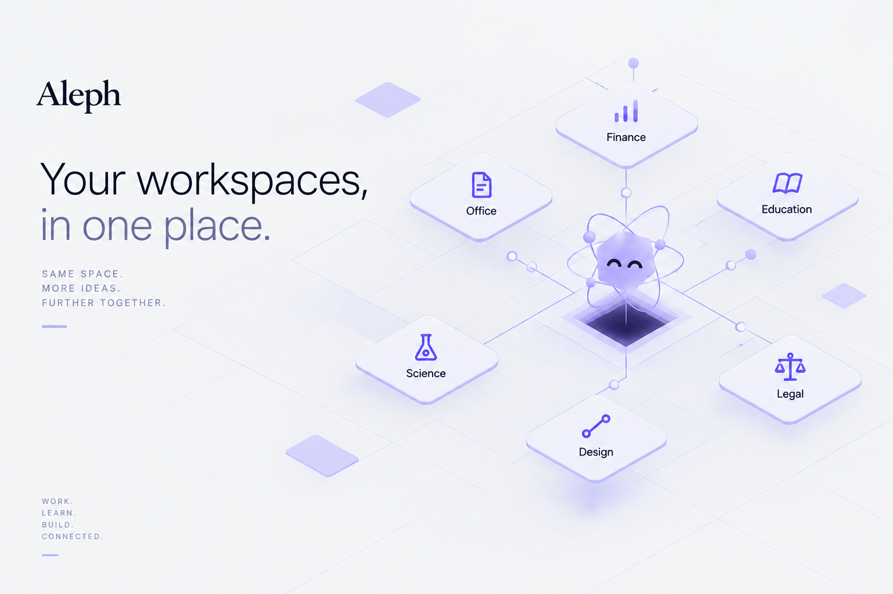
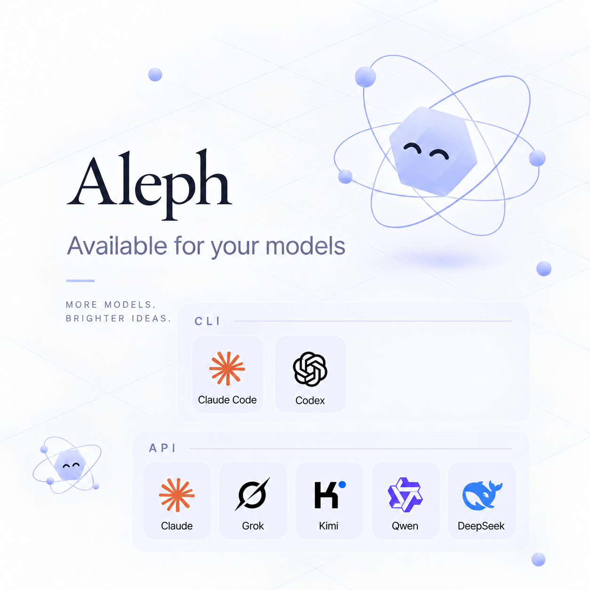
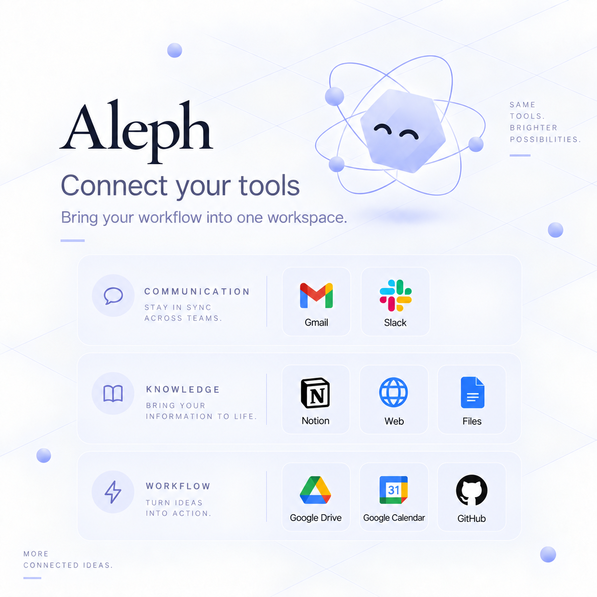

# Aleph

**One space. Infinite work.**

Aleph is a desktop workspace that brings your AI models, tools, and files together.
Work in La Sala, explore specialized workspaces, and compose reusable agents and
workflows in **The Workshop / El Cuarto** — without being tied to a single model.

[Website](https://aleph-site-jade.vercel.app/) ·
[Source release v0.1.2](https://github.com/josuecuguy1307/Aleph/releases/tag/v0.1.2) ·
[Getting Started](docs/GETTING_STARTED.md) ·
[Build from source](BUILDING.md)

> **macOS 0.1.2 download:** the final DMG is not published yet. The current
> [0.1.2 release](https://github.com/josuecuguy1307/Aleph/releases/tag/v0.1.2)
> contains source and guest assets, not a macOS installer.

## How to use Aleph

1. **Download and install on macOS.** Once the 0.1.2 DMG is published, use the
   official download linked from the [website](https://aleph-site-jade.vercel.app/).
   Open the DMG and move Aleph to Applications.
2. **Open Aleph.** Follow the setup prompts and choose your preferred language.
3. **Choose your model.** Connect an API provider or an installed, authenticated
   CLI provider such as Claude Code or Codex. Use your own provider access.
4. **Start in Home / La Sala.** Pick an agent, describe what you want to do, and
   work with the resulting files and artifacts.
5. **Open a specialized workspace:** Science, Education, Office, Finance, Legal,
   or Design — depending on the work in front of you.
6. **Make it your own in The Workshop / El Cuarto.** Compose agents, equip tools,
   and arrange workflows you can return to later.

Aleph is **model-agnostic**: available models depend on your installed providers,
authentication, and provider access limits. Local capabilities and connectors
may need explicit installation, configuration, or authorization before use.

[Continue with Getting Started →](docs/GETTING_STARTED.md)

## Your models. Your tools.

Bring the provider you want to use and connect the services your work needs.
Models, CLI agents, and connectors are separate capabilities — connecting one
does not automatically authorize the others.

| Models and CLI providers | Connected tools |
| --- | --- |
|  |  |

These illustrations show product concepts, not a guarantee that every integration
is ready on your machine. Availability depends on setup and permissions.
**Onshape remains optional / not certified.**

## Build from source

See [BUILDING.md](BUILDING.md) for prerequisites, the official build path, and
current reproducibility limitations.

## Open source

Aleph-owned source is licensed under [Apache-2.0](LICENSE). Third-party components
retain their own licenses; see [THIRD_PARTY_NOTICES](THIRD_PARTY_NOTICES).

The **Aleph name, logo, mascot, and official branding** — including the product
imagery in this README — are covered separately by [TRADEMARKS.md](TRADEMARKS.md),
not granted by Apache-2.0. Forks may describe their origin factually, but must not
imply official status or endorsement. [Image provenance](assets/readme/README.md).

Want to contribute? Start with [CONTRIBUTING.md](CONTRIBUTING.md).

## Current release

**0.1.2** · [Source release and release notes](https://github.com/josuecuguy1307/Aleph/releases/tag/v0.1.2)

The exact guest kernel, root filesystem, and matching third-party source bundle
are available as separate release assets. [Guest asset details](deploy/guest/ASSETS.md)
and [compliance](deploy/guest/COMPLIANCE.md) remain accessible for developers;
full guest-image regeneration from source is not yet claimed.

The certified source baseline and snapshot scope are recorded in
[SOURCE_PROVENANCE.json](SOURCE_PROVENANCE.json). This README is the product-facing
introduction; the immutable `v0.1.2` tag preserves the original certified snapshot.
